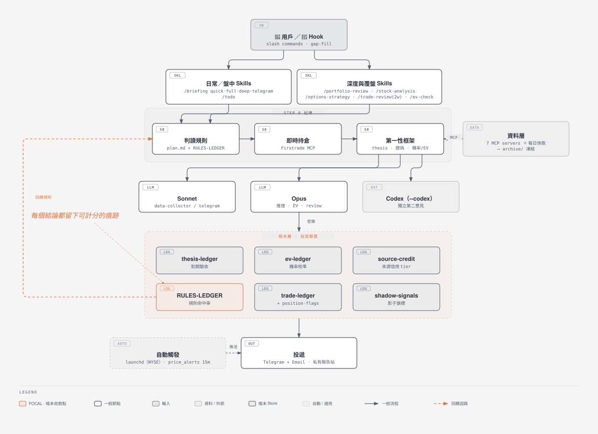

# Portfolio — Claude Code 投資研究與組合管理框架

一套建構在 **Claude Code skills + MCP servers** 之上的美股投資研究與組合管理工作區。把日報、組合檢視、個股深度分析、選擇權策略、交易日誌等流程，全部封裝成可重複執行的 slash command，並用一套**第一性原理紀律**（可驗證 thesis → 證偽條件 → 機率分布 + EV）約束每一個投資結論，避免淪為 narrative。

- **使用對象**：自行操作美股/選擇權、想用 LLM 輔助但要求紀律與可驗證性的個人投資人 / quant
- **輸出語言**：全繁體中文
- **券商整合**：透過 `firstrade-server` MCP 取即時持倉（以 Firstrade 為參考整合，可替換成你自己的券商 MCP）

> ⚠️ **非投資建議。** 本專案是分析與紀律工具，所有輸出僅供研究參考；你需自行承擔所有交易決策與風險，並自備所有 API key / 券商憑證。詳見文末免責聲明。

> 📦 自寫的兩個 MCP server（`technical` 技術指標、`eodhd` 情緒）已獨立開源於 **[fadacai-mcp-servers](https://github.com/PatrickSUDO/fadacai-mcp-servers)**。

---

## 架構



完整頁面版（含各層說明卡）見 [`docs/architecture.html`](docs/architecture.html)；圖以 [diagram-design](https://github.com/cathrynlavery/diagram-design) 設計系統繪製。

---

## 核心設計

- **第一性紀律** — 任何 Verdict 前強制回答「核心 thesis（可驗證命題）/ 證偽條件（falsifiable 觀察點）/ 機率分布 + EV」三題，禁止 narrative 與 default bell shape。詳見 [`docs/methodology.md`](docs/methodology.md)。
- **三錨點估值 + A4 影子錨** — Fair PE 用市場隱含 PE / PEG 成長合理倍數 / 分析師 PT 隱含 PE 三角定位；另建 A4 自建估值錨做「我的盈利觀 vs Street」分歧偵測（display-only，不進 EV）。詳見 [`docs/methodology.md`](docs/methodology.md)。
- **四本自我驗證帳本** — [Thesis Ledger](docs/thesis-ledger.md)（thesis 到期機械驗收 passed/failed）、EV Ledger（機率分布+三情境公允價事前登錄，到期機械驗價）、[來源信用帳](docs/source-credit.md)（X/Substack/RSS 主張逐則計分，tier 機械升降）、影子訊號帳（A4 高估旗標 + R18 財報窗擋單）——每個結論都留痕，可回頭計分校準，不是說完就算。
- **規則命中率帳本 + `/trade-review` 自我進化迴路** — 每條 feedback 規則帶命中/失效紀錄，規則存廢由實測裁決、不因模型換代歸零；每兩週歸因每筆成交（系統決策 vs 自主決策），計算交易 α / 持有 α / beta capture 三個並列指標。詳見 [`docs/methodology.md`](docs/methodology.md)。
- **發現層先行指標** — 財報 gate 之外的五組更早硬數字前哨（信用利差速度、VIX 期限結構、半導體寬度、revision 二階導雙法、台股功率元件月營收），全部 display-only，命中率驗證後才可升閘門。詳見 [`docs/leading-indicators.md`](docs/leading-indicators.md)。
- **每日 cache 預載 + archive 凍結** — launchd 每個交易日預抓總經/基本面/新聞/先行指標快取（zero-latency 供日報讀取），並將當日決策輸入凍結 120 天，供盲測重推導與 revision 二階導回溯，不受事後 hindsight 污染。
- **自動推送 + 價格警報** — launchd 定時生成並推送 Telegram + Email 摘要，另有 15 分鐘輪詢的自建價格警報。詳見 [`docs/briefing-auto-send.md`](docs/briefing-auto-send.md)。

---

## 快速開始

```bash
# 前置需求：Claude Code CLI、Python 3.10+、uv（建議）
git clone <this-repo-url> portfolio && cd portfolio

pip3 install -r tools/requirements.txt
cp .env.example .env      # 依註解填入你自己的 key（純互動分析可略過）

claude
> /mcp-health             # 先確認 7 個 MCP server 連線
> /briefing               # 跑第一份日報
```

MCP 安裝與環境變數完整說明見 [`docs/setup.md`](docs/setup.md)。

---

## 指令一覽

| 指令 | 用途 | 模型 | 預估時間 |
|------|------|------|---------|
| `/briefing` | 快速日報（技術面 + 警示 + 計畫進度） | Sonnet | ~1 min |
| `/briefing full` | + 情緒面 + 市場動態 + 預測市場 | Sonnet | ~3 min |
| `/briefing deep` | + SEC + FMP + 個股深度分析 | Opus | ~5 min |
| `/briefing telegram` | Telegram 推送格式（emoji 純文字，寫出 briefing-out/ 兩個檔案） | Sonnet | ~2-3 min |
| `/briefing telegram --send` | 同上，並實際推送至 Telegram + 寄送 email | Sonnet | ~2-3 min |
| `/portfolio-review` | 完整組合報告（板塊配置 + 個股分析） | Opus | ~3-5 min |
| `/stock-analysis TICKER` | 個股深度研究（支援多股比較） | Sonnet / Opus | ~2 min |
| `/options-strategy TICKER STRATEGY` | 選擇權策略計算（E_adj 排序） | Sonnet | ~1-2 min |
| `/todo` | 下一交易日 / 盤中 / 盤後優先行動清單 | Sonnet | ~1 min |
| `/ev-check [7d\|14d\|30d]` | 強制第一性機率分布 + 組合 EV 計算 | — | ~1 min |
| `/trade-journal log\|review\|summary\|auto` | 交易記錄與回顧 | — | ~1 min |
| `/trade-review [2w\|4w]` | 每兩週交易檢討：成交歸因（系統 vs 自主）+ 三並列指標（交易 α / 持有 α / beta capture）+ 規則命中率帳本 | Opus | ~3-5 min |
| `/event-vol-scan [days] [TICKER ...]` | 財報/CPI/FOMC 前末日 buy call / 雙買 straddle 機會掃描 | Opus | ~2 min |
| `/mcp-health` | 測試所有 MCP server 連線狀態 | — | ~30 sec |

**`--send` 旗標：** 可加在任何 tier 後，執行完自動推送 Telegram + email。例：`/briefing full --send`

**`--codex` 旗標：** 任何分析 skill 後加，觸發 Codex 獨立第一性分析（B1）+ 機會掃描（B2）+ 輪動分析（B3）；`--codex-adversarial` 觸發壓力測試模式。

**模型切換：** 若 harness 未自動套用 frontmatter model，手動 `/model sonnet` / `/model opus` 後再執行；session context > 100k 建議先 `/compact`。

---

## 文件

- [`docs/setup.md`](docs/setup.md) — 安裝步驟、7 個 MCP server 設定與註冊指令、環境變數表、關鍵本地檔案、常見問題
- [`docs/setup-troubleshooting.md`](docs/setup-troubleshooting.md) — 從零安裝實際會卡住的 7 個踩坑速查
- [`docs/briefing-auto-send.md`](docs/briefing-auto-send.md) — Telegram/Email 自動推送完整設定、pipeline 架構、疑難排解
- [`docs/fmp-containerization.md`](docs/fmp-containerization.md) — fmp-mcp 容器化架構、watchdog、日常操作與回滾
- [`docs/methodology.md`](docs/methodology.md) — 方法論細節：第一性紀律、三錨點估值、各帳本設計、如何擴展
- [`docs/thesis-ledger.md`](docs/thesis-ledger.md) — Thesis Ledger 資料模型、去重機制、CLI、驗收流程
- [`docs/leading-indicators.md`](docs/leading-indicators.md) — 發現層先行指標五 block 架構與防假訊號設計
- [`docs/source-credit.md`](docs/source-credit.md) — 來源信用系統：計分公式、tier 升降規則、X API 成本控管
- [`docs/architecture.html`](docs/architecture.html) — 系統架構圖完整頁面版（`docs/architecture.svg` 為 README 用）

完整規範（Step 0 統一規範、MCP 政策、模型分工、旗標紀律）見 [`CLAUDE.md`](CLAUDE.md)。

---

## 授權

[MIT License](LICENSE) — 自由使用、修改、商用，保留版權聲明即可。

## 免責聲明

本專案為**投資研究與紀律輔助工具**，所有輸出（含 Verdict、EV、機率、選擇權建議）**僅供研究與教育參考，不構成投資建議、要約或保證**。美股與選擇權交易具高度風險，可能導致本金全部損失。你需自行評估並承擔一切交易決策與後果，並自備所有 API key 與券商憑證；作者與貢獻者不對任何使用本專案所致之損失負責。
